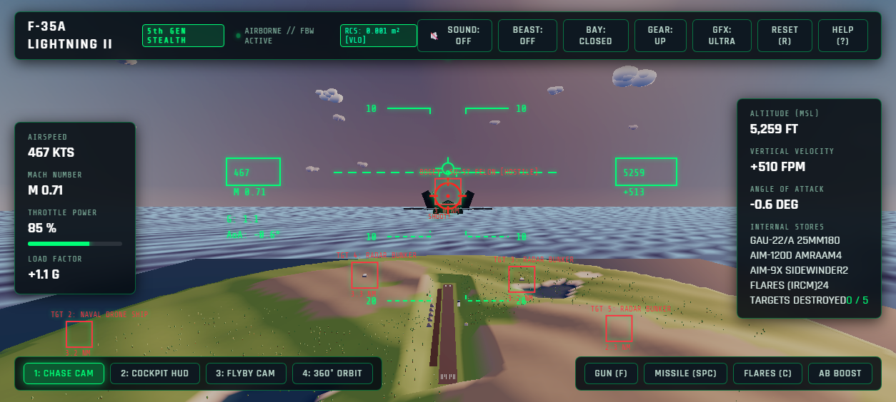
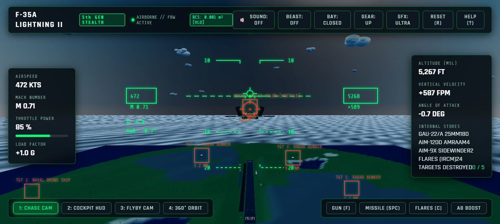
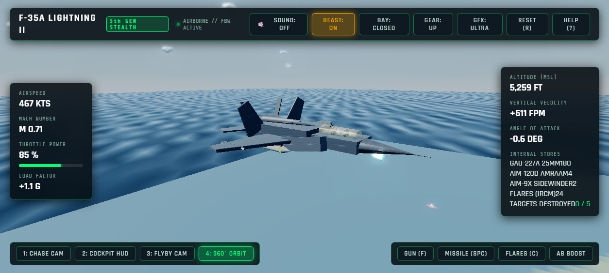
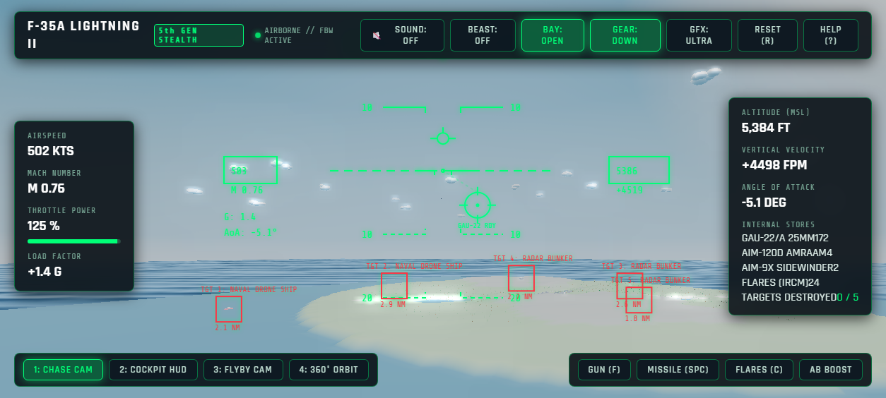
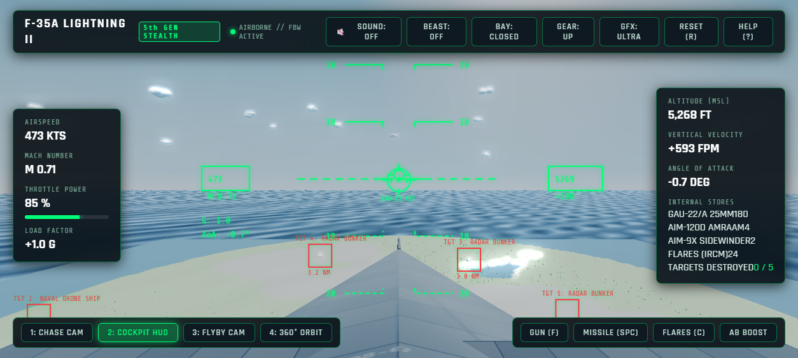
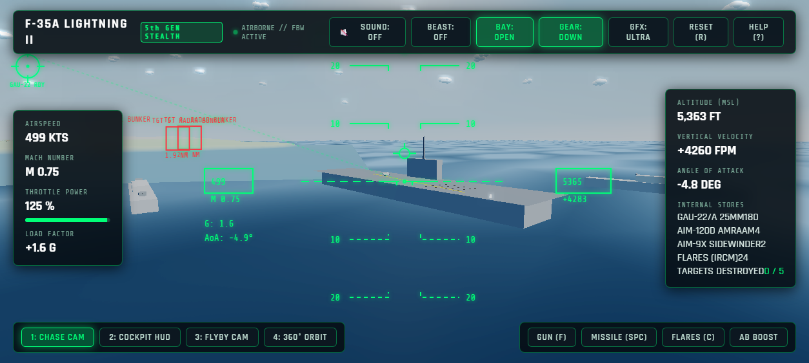
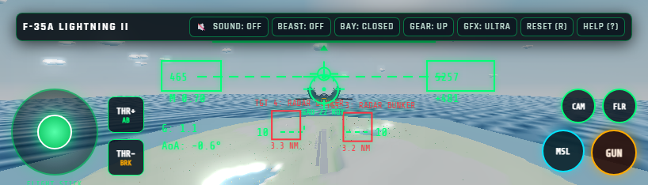
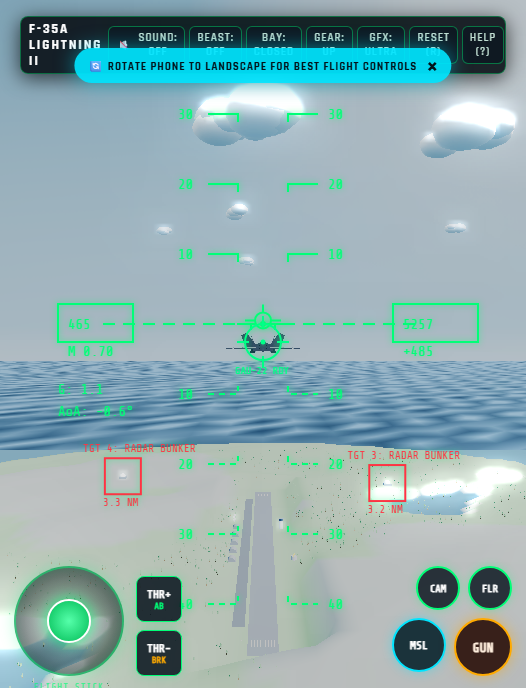

# F-35 Lightning II — 3D Flight Simulation

[](https://threejs.org/)
[](https://www.khronos.org/webgl/)
[](index.html)
[]()

An ultra-high-fidelity 3D flight simulation of the **Lockheed Martin F-35A Lightning II** stealth multirole fighter jet, contained entirely in **one single, standalone HTML file** (`index.html`).

Features true 6-DoF aerodynamic flight physics, PBR materials with Have Glass V radar-absorbent coating, real-time trochoidal Gerstner ocean waves, a dynamic time-of-day engine (Day / Sunset / Night with airfield and carrier illumination), an active procedural Web Audio soundscape, and combat systems with enemy Su-57 Felon dogfight AI and SAM radar cross section (RCS) mechanics.

---

## Visual Showcase

| Golden Sunset Flight | Starry Night Stealth Operations |
|:---:|:---:|
|  |  |

| F-35 Beast Mode (External Hardpoints) | GAU-22/A 25mm Rotary Gatling Cannon |
|:---:|:---:|
|  |  |

| Cockpit HMDS & Forward HUD | Offshore Carrier Strike Group |
|:---:|:---:|
|  |  |

| Mobile Phone Landscape Controls | Mobile Phone Portrait Controls |
|:---:|:---:|
|  |  |

---

## Key Features

### 1. F-35A Aircraft Model & Systems
- **Stealth Airframe**: Sculpted chined forebody blending into Diverterless Supersonic Intakes (DSI), low-observable Have Glass V RAM coating, and forward-pointing radar nose cone with pitot probe.
- **Under-Nose EOTS**: Faceted sapphire optical window prism mounted beneath the chin with internal emerald sensor.
- **Detailed Cockpit & HOTAS**: Gold-iridium tinted canopy, pilot with Gen III Helmet-Mounted Display (HMDS), Martin-Baker Mk.16 ejection seat, wide panoramic touch displays, and animated right-hand side-stick and throttle lever.
- **Beast Mode Pylon Deployment (`P` key / UI toggle)**: Mounts 4 under-wing weapon pylons equipped with dual AIM-9X Sidewinder air-to-air missiles and dual GBU-31 JDAM precision bombs.
- **Articulated Flight Surfaces**: Dynamic differential horizontal stabilators, twin canted vertical rudders, and high-lift trailing-edge flaperons.
- **Pratt & Whitney F135 Engine**: Dynamic afterburner flame core, shock diamonds, and luminous heat exhaust with supersonic sonic boom detonations.

### 2. Dynamic Time-of-Day & Atmospheric Engine
- **Day / Sunset / Night Modes (`T` key / UI button)**:
  - **Mid-Day**: Crisp sunlight, turquoise shallow waters, and distant horizon haze.
  - **Golden Sunset**: Rayleigh atmospheric scattering, fiery water specular reflections, and long golden shadows.
  - **Night Stealth Operation**: Dark starry sky, night-vision HUD, and illuminated airbase.
- **Airfield & Naval Night Illumination**:
  - 10,000 ft runway edge white lights, green approach threshold lights, and red rollout end lights.
  - Dual-color rotating airport surveillance beacon on the control tower.
  - Aircraft carrier perimeter landing floodlights and island beacon.
  - **F-35 Formation "Slime Lights"**: Electro-luminescent emerald green strips along the vertical fins and nose chines that glow with UnrealBloomPass bloom during night sorties.

### 3. Procedural Web Audio Engine
Synthesized entirely in the browser using the Web Audio API with zero external audio samples:
- **Turbofan Whine & Jet Blast**: Dynamic frequency and gain tracking throttle from idle hum to supersonic afterburner scream.
- **Transonic Sonic Boom**: Explosive sub-bass detonation when crossing Mach 1.0.
- **GAU-22/A 25mm Rotary Gatling Cannon**: Rapid 55 Hz pulse synthesizer simulating authentic high-rate Gatling bursts.
- **AIM-120 Missile Launch**: Pneumatic ejection sound followed by solid rocket propellant burn.
- **Countermeasure Flares**: Pyrotechnic pop and crackle of magnesium IRCM decoys.
- **Cockpit Audio Betty Alerts**: Speech synthesis callouts (*"WARNING: SAM LAUNCH"*, *"SPLASH ONE - BOGEY DOWN"*, *"PULL UP"*).

### 4. Combat Systems & Radar Cross Section (RCS) Mechanics
- **Airborne Adversary (Su-57 Felon)**:
  - Circles the archipelago on combat air patrol (CAP) with realistic flight banking and wingtip contrails.
  - Fully targetable with the dynamic GAU-22/A ballistic gun pipper or radar-guided AIM-120 AMRAAM missiles.
  - Upon destruction, enters a fatal flat spin trailing fire and black smoke, crashing into the ocean with an explosive splash.
- **Surface-to-Air Missile (SAM) Threat Battery**:
  - Calculates the F-35's real-time Radar Cross Section:
    - **Clean Stealth Configuration**: $RCS = 0.001 \text{ m}^2$ (Very Low Observable). SAM detection range restricted to $< 1.8 \text{ NM}$.
    - **Weapons Bay Open**: $RCS = 0.351 \text{ m}^2$. Internal cavity reflection increases detection envelope.
    - **Beast Mode External Pylons**: $RCS = 2.150 \text{ m}^2$. SAM radar locks up to $8.0 \text{ NM}$ away!
  - SAM site launches guided interceptor missiles leaving dense white smoke rocket trails.
  - **Defensive Countermeasures**: Deploy flares (`C` / `FLR`) to decoy incoming heat-seeking missiles, or pull high-G break maneuvers ($> 6.5 \text{ G}$) to force the missile to overshoot its turn limit.

### 5. Cross-Platform Responsive Controls
- **Desktop (Keyboard / Mouse)**:
  - `W` / `S`: Pitch Down / Pitch Up
  - `A` / `D`: Roll Left / Roll Right
  - `Q` / `E`: Rudder Yaw Left / Right
  - `Shift` / `Ctrl`: Throttle Up / Down (Afterburner at >100%)
  - `F` / Left-Click: Fire 25mm Rotary Cannon
  - `Space`: Launch AIM-120 AMRAAM Missile
  - `C`: Dispense Decoy Flares
  - `G`: Toggle Landing Gear
  - `B`: Toggle Weapons Bay
  - `P`: Toggle Beast Mode
  - `T`: Toggle Time of Day (Day / Sunset / Night)
  - `M`: Toggle Sound Engine (Audio ON / OFF)
  - `1`, `2`, `3`, `4`: Chase Cam, Cockpit HUD, Flyby Cam, 360° Orbit Cam
- **Mobile Phone / Tablet (Touch)**:
  - Dual-axis virtual flight stick with spring-back centering.
  - Left thumb `THR+` (Afterburner) and `THR-` (Airbrake) throttle steppers.
  - Right thumb dedicated triggers: `GUN` (continuous Gatling stream), `MSL` (missile fire), `CAM` (camera cycle), `FLR` (flares).
  - Landscape auto-recommendation banner in portrait orientation.

---

## How to Run

### Direct Browser Link
Open [index.html](index.html) directly in any modern web browser:
- Google Chrome
- Microsoft Edge
- Apple Safari (iOS / macOS)
- Mozilla Firefox

### Local HTTP Server (For Mobile Phone Testing)
To test on your mobile phone over local Wi-Fi:
```bash
python -m http.server 8088
```
Then navigate to `http://<your-computer-ip>:8088/index.html` on your mobile phone browser.

---

## Architecture & Technical Stack

- **Graphics Library**: Three.js (r128) via CDN
- **Rendering Pipeline**: PMREMGenerator (PBR IBL) + EffectComposer (UnrealBloomPass)
- **Ocean Simulation**: Custom GLSL trochoidal Gerstner wave vertex & fragment shaders
- **Audio Synthesizer**: Web Audio API (oscillators, biquad bandpass filters, noise buffers, SpeechSynthesis)
- **Packaging**: Single zero-dependency HTML file (`~155 KB`)
